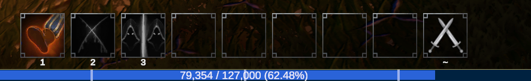

## Enhanced Experience Bar
Enhances the experience bar by
* Increasing the height of it
* Displaying a label showing
  * How much experience the player has gained in the current level
  * The experience required to reach the next level
  * The percentage of the way through the current level (to 2 decimal places)

### Subscribes to the following events
* `WindowPanelEvents::OnExperienceBarReady`, to add the label to the experience bar
* `LocalPlayerEvents::OnLocalPlayerReady`, to grab the initial experience when player is loaded in
* `LocalPlayerEvents::OnExperienceChanged`, to update the label text when experience is gained 